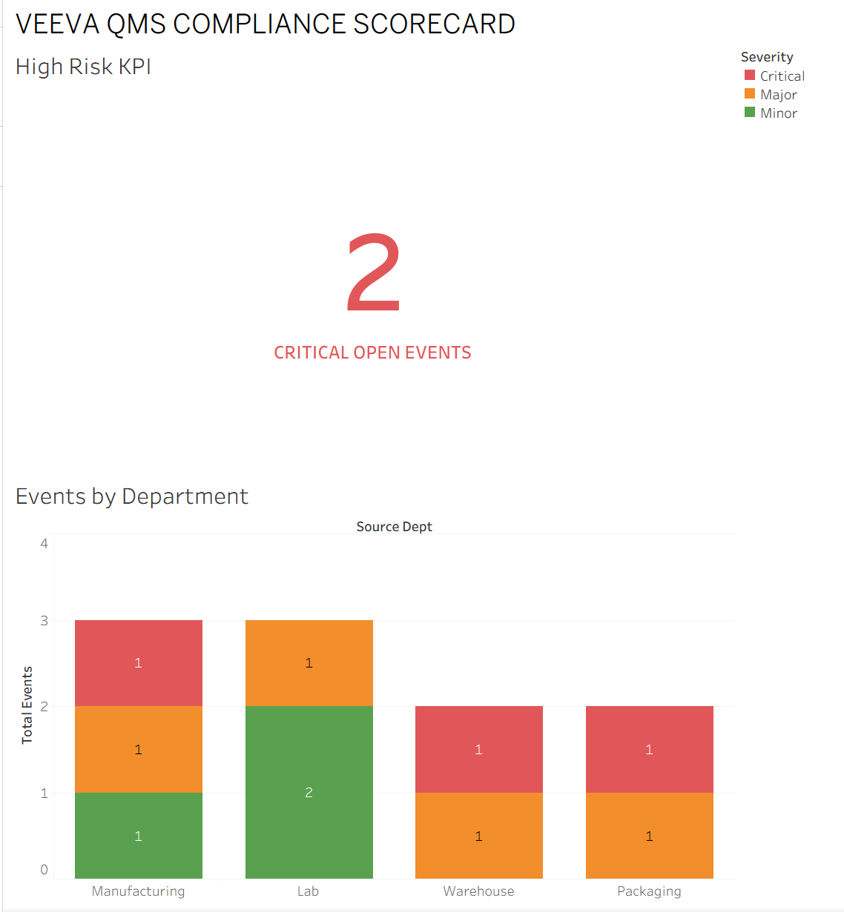

# Veeva 360 Risk Suite: End-to-End Compliance Solution
**Author:** Sandip Panchal  
**Tools:** SQL (Engineering), Python/Google Colab (Audit & Automation), Tableau & Power BI (BI Scorecards)

## 📊 Business Problem
In regulated Life Sciences, critical quality "deviations" can occur in a lab or warehouse. If these stay open without notice, a company risks audit failure. 

**Objective:** To close the "Latency Gap" between data generation and executive action by automating risk isolation.

---

## 🛠 Project Phases
1. **Data Engineering (SQL):** Built a dataset mimicking a Veeva Vault QMS environment with unique primary keys for data integrity.
2. **Automation & Audit (Python):** Developed a Google Colab script to verify risk isolation logic and reduce manager notification time from hours to seconds.
3. **Business Intelligence:** Deployed the system across Tableau and Power BI to provide executive visibility into compliance health.
Tableau: 
PowerBI:

## ✅ Project Outcomes
- Isolated critical events posing the highest audit threat.
- Automated a manual monitoring process into an alert-driven system.
- Ensured 100% data integrity for audit readiness.
