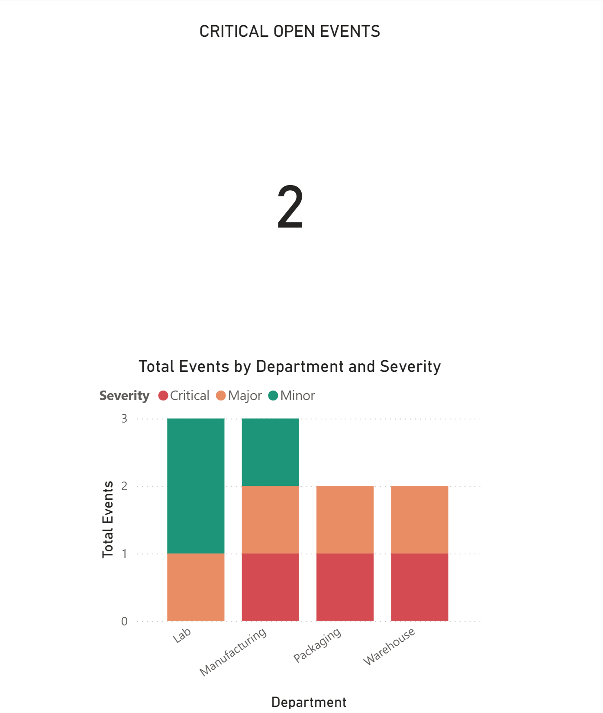

# Veeva 360 Risk Suite

> A focused proof-of-concept that demonstrates the **end-to-end pattern** for compliance risk isolation in a Veeva Vault QMS-style environment — from SQL data layer through Python automation to executive BI dashboards in both Tableau and Power BI.

**Author:** Sandip Panchal
**Stack:** SQL · Python (Pandas) · Tableau · Power BI

🔗 **[Interactive Tableau dashboard →](https://public.tableau.com/app/profile/sandip.panchal/viz/VeevaQSMCompliance/Dashboard1)**

---

## The Business Problem

In regulated Life Sciences, lab and warehouse "deviations" — events where a process did not meet its specification — must be triaged and resolved before they trigger audit findings. The longer a high-severity deviation stays open without management visibility, the higher the audit risk.

Most organizations have the data. The gap is **latency**: the time between an event being logged and the right manager seeing it.

**Goal:** Demonstrate a pattern that closes that latency gap — automating the isolation of high-risk events from a QMS data source and surfacing them to executives in real time.

---

## Solution Overview

A three-layer pipeline showing how a compliance risk-isolation system would flow end-to-end:

```
┌──────────────┐    ┌──────────────────┐    ┌────────────────────┐
│ SQL Layer    │ →  │ Python Audit /   │ →  │ Tableau & Power BI │
│ (QMS schema) │    │ Risk Isolation   │    │ Executive Scorecards│
└──────────────┘    └──────────────────┘    └────────────────────┘
```

---

## Technical Approach

### 1. Data Layer (SQL)
A simulated QMS schema modeling the core entity in a deviation-tracking system:

- A `Deviations` table keyed on `Record_ID`, tracking severity, status, source department, and date opened
- Seeded with sample records spanning different departments (Manufacturing, Lab, Packaging, Warehouse) and severity tiers (Critical, Major, Minor)
- Demonstrates the SQL pattern for isolating high-risk events: `WHERE Severity = 'Critical' AND Status = 'Open'`

📂 See [`SQL/`](SQL/)

### 2. Risk Isolation (Python)
A Pandas-based automation layer that shows how the SQL filter pattern would run on a recurring basis:

- Reads the deviations dataset into a DataFrame
- Applies the risk-isolation filter (severity + status)
- Generates a manager-facing alert message listing critical open events and their source departments
- Designed to be the engine behind a scheduled job that would notify managers without waiting for a manual weekly review

📂 See [`Python/`](Python/)

### 3. Executive BI Layer (Tableau & Power BI)
The same compliance scorecard built in both tools to demonstrate cross-platform fluency:

- Shows deviation counts by status, severity, and source department
- Designed for an executive audience: at-a-glance, no drill-down required
- Tableau version is published publicly for interactive review

---

## Dashboards

### Tableau
[](https://public.tableau.com/app/profile/sandip.panchal/viz/VeevaQSMCompliance/Dashboard1)

*Click the image above for the interactive Tableau Public version.*

### Power BI


---

## Repository Structure

```
.
├── SQL/                                          # Schema + risk-isolation query
├── Python/                                       # Pandas notebook implementing the alert logic
├── Documentation/                                # Project documentation
├── Tableau_Veeva_Compliance_Scorecard_Final.png
├── Power-BI_Veeva_Compliance_Scorecard_Final.png
└── README.md
```

---

## What I Learned

- **The risk-isolation logic itself is simple; the value is in the pipeline.** The SQL `WHERE` clause and the equivalent Pandas filter are trivial — what makes this useful is wrapping that simple logic in an automated pipeline that delivers it to the right place without human intervention.
- **Building the same scorecard in Tableau and Power BI surfaces real differences.** They feel similar at first but diverge quickly on layout, color, and filter behavior. Worth knowing both so you can match the tool to the team that will use it.
- **Compliance dashboards are dense by design.** Unlike consumer dashboards that prioritize storytelling, an executive compliance scorecard needs to fit "is anything on fire right now?" into one screen. That changes how you think about visual hierarchy.

---

## Next Steps

This is a focused proof of concept. The natural extensions are:

- **Multi-table schema** — add a related `CAPAs` table with a foreign key to `Deviations`, track CAPA effectiveness alongside the deviations themselves
- **Time-based metrics** — extend the schema with `Date_Closed`, compute time-to-close and overdue flags, surface aging deviations on the dashboard
- **Real data-integrity checks** — assertion-based validation in Python that verifies no orphaned references, no records missing required fields, and no impossible dates before publishing to the BI layer
- **Scheduled execution** — wrap the Python script in a scheduled job (cron / GitHub Actions / Airflow) so the risk isolation runs automatically rather than on demand

---

*Self-directed portfolio project. No proprietary Veeva data was used; all records are synthetic and modeled after publicly documented Veeva Vault QMS conventions.*
